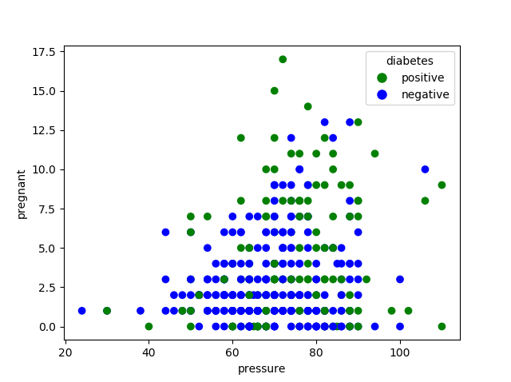
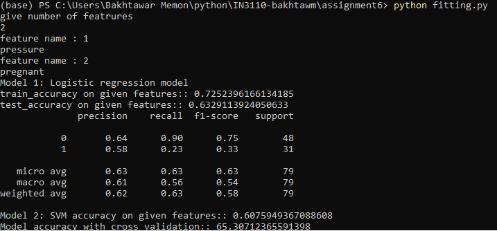
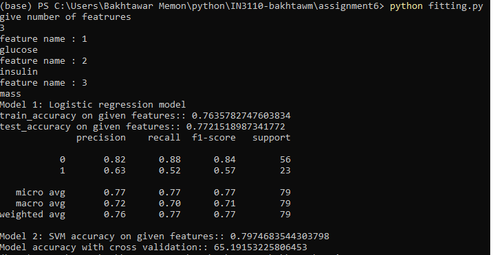
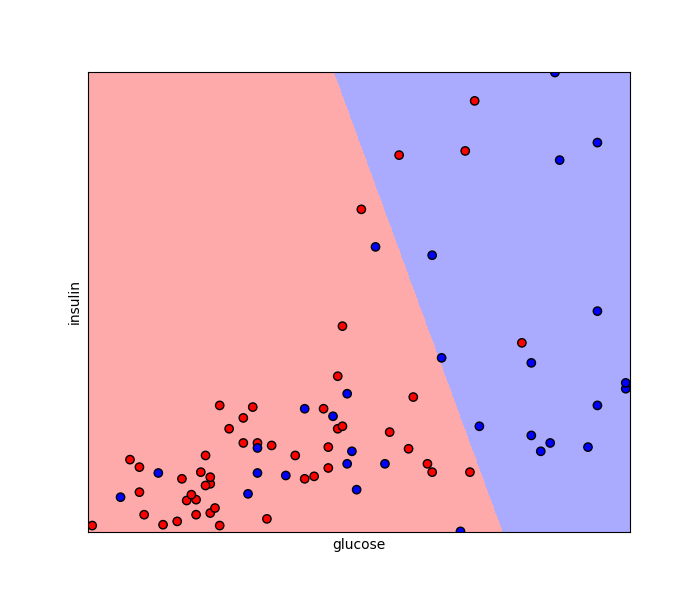

# 6.1
## File: data.py 

The script ```data.py``` requires user to provide two arguments from command line namely *feature 1*, and *feature 2* and passes these to function ```create_scatter_plot(feature_1, feature_2)```. The function processes the arguments and create scatter plot of the two dimensions of the feature space
and shows how the given dimensions relates to the diabetes class.

The script also divides the data in diabetes.csv into training and test sets.

**Example usage**

python data.py -o glucose -t insulin

python data.py -o pressure -t pregnant



# 6.2
## File: fitting.py

The script ```fitting.py``` asks user to enter number of features and the names of those features. It then extracts training and test data accordingly. 

Model 1: Logistic Regression

Model 2: Support Vector Machine model 

The scripr trains the model. Displays traing and test accuracy. 

**Example usage**

python fitting.py





# 6.3
## File: visualize.py

The script ```visualize.py``` has a function ```visualize_plot()``` that visualize the classier when the chosen feature subset has only 2 features.

**Example usage**

python visualize.py



# 6.4
## File: web_visualize.py

The script displays the plot created from script 6.3 on the web page.

**Example usage**

python web_visualize.py
